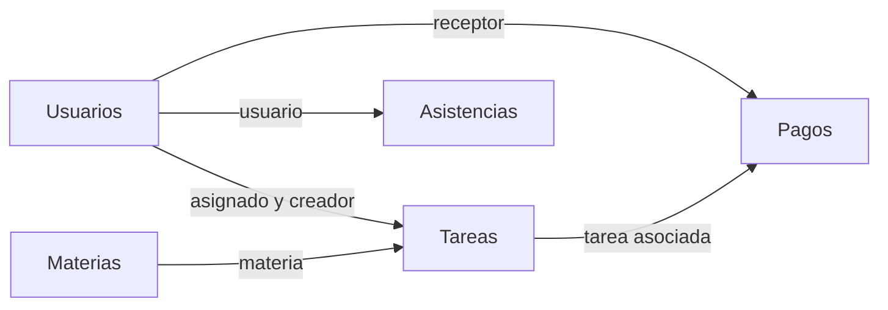

# Sala de Tareas

Proyecto de **Python intermedio** para organizar usuarios, tareas y registros de
pagos. Construido con Python 3.11+, Flask, SQLite (`sqlite3`), Jinja2, HTML, CSS y
JavaScript sencillo. Las siete etapas del alcance educativo están terminadas.

**PayPal es una simulación local: no realiza cobros ni transferencias.**

## Guías para presentar el proyecto

| Necesitas… | Documento |
| --- | --- |
| Exponer y hacer la demostración | [Guion de presentación](docs/PRESENTACION.md) |
| Copiar los comandos para arrancar | [Ejecutar la app](docs/EJECUTAR.md) |
| Ejecutar todas las pruebas o una parte | [Comandos de pruebas](docs/PRUEBAS.md) |
| Entender y defender el código | [Exposición técnica](docs/EXPOSICION_PROYECTO.md) |
| Entender los decoradores `@` | [Guía de decoradores](docs/GUIA_DECORADORES_ROUTES.md) |
| Consultar configuración, reglas y migraciones | [Instalación y uso](docs/INSTALACION_Y_USO.md) |

Toda la documentación está en [docs/](docs/README.md). Los planes anteriores se
conservan en [docs/historial/](docs/historial/README.md), identificados como históricos.

## Qué permite hacer

| Función | Administrador | Miembro |
| --- | --- | --- |
| Dashboard | Todas las tareas y totales de pagos por moneda | Solo sus tareas |
| Usuarios | Crear, consultar, editar, eliminar o desactivar | Sin acceso |
| Tareas | Crear, asignar, consultar, editar y eliminar | Consultar las asignadas y cambiar su estado |
| Materias | Crear, listar, consultar, editar y eliminar si no tienen tareas | Ver la materia en sus tareas |
| Pagos | Registrar, consultar, editar según estado y anular | Sin acceso |
| Simulación de PayPal | Aprobar, rechazar o cancelar un pago ficticio | Sin acceso |

Los listados de usuarios, tareas y pagos tienen búsqueda, filtros combinables y páginas de 10 registros.
La interfaz se adapta a móvil y ofrece modo claro/oscuro: recuerda la elección en
el navegador y, si no hay una guardada, utiliza la preferencia del sistema.
No hay registro público. Crea las materias desde **Materias** antes de seleccionarlas
al crear o editar tareas. El título, el enlace **Ver detalle** y la fila de cada tarea
permiten abrir su detalle. En **Pagos**, abre el detalle desde **Pago #**, **Ver detalle**
o haciendo clic en la fila. Las asistencias conservan su alcance actual.

## Arranque rápido

Ejecutar desde la **raíz del proyecto**, en PowerShell.

### Si el entorno, la base y el administrador ya están preparados

```powershell
.\.venv\Scripts\Activate.ps1
$env:SECRET_KEY = python -c "import secrets; print(secrets.token_hex(32))"
python run.py
```

Abrir **http://127.0.0.1:5000/**. Detener con `Ctrl+C`.
Generar otra clave invalida las sesiones anteriores; para conservarlas entre
arranques, volver a asignar la misma clave desde tu configuración privada.

### Primera instalación: base nueva

```powershell
python -m venv .venv
.\.venv\Scripts\Activate.ps1
python -m pip install -r requeriments.txt
$env:SECRET_KEY = python -c "import secrets; print(secrets.token_hex(32))"
python -m flask --app run init-db
python -m flask --app run create-admin
python run.py
```

`create-admin` pide nombre, correo y contraseña de 8–128 caracteres. Solo crea el
primer administrador activo. Las siguientes cuentas se crean desde **Usuarios**.
Si PowerShell no permite activar el entorno, sustituir `python` por
`.\.venv\Scripts\python.exe` en los comandos posteriores a crear `.venv`.

### Si la base es antigua

Con la app detenida, ejecutar en orden:

```powershell
python -m flask --app run migrate-users
python -m flask --app run migrate-tasks
python -m flask --app run migrate-payments
```

Estos comandos conservan datos y crean un respaldo al actualizar. No son
necesarios para una base nueva. `init-db` no actualiza tablas existentes.
No hay migraciones automáticas al importar módulos o arrancar la app.

## Estructura del proyecto

```text
proyectoweb/
├── README.md                   # Entrada al proyecto y esquema de SQLite
├── agents.md                   # Instrucciones para agentes; permanece en la raíz
├── run.py                      # Configuración y arranque de Flask
├── requeriments.txt            # Dependencias (nombre original)
├── .env.example                # Referencia de variables; no se carga automáticamente
├── app/
│   ├── routes.py               # Rutas, sesiones, permisos y comandos
│   ├── forms.py                # Validación del servidor
│   ├── models.py               # Opciones y dinero con Decimal; sin ORM
│   ├── utils/
│   │   ├── paypal_simulator.py  # Resultados de pago ficticios
│   │   └── data/
│   │       ├── database.py     # Conexión e inicialización explícita
│   │       └── CRUD.py         # Consultas SQL parametrizadas
│   ├── templates/             # Plantillas Jinja: acceso, usuarios, tareas y pagos
│   └── static/                # CSS e iconos/tema mediante recursos locales
├── migrations/                # Scripts explícitos con sqlite3 y respaldos
├── tests/                     # Pruebas con SQLite temporal
└── docs/
    ├── README.md              # Índice de las guías
    ├── PRESENTACION.md        # Guion breve y recorrido de la demostración
    ├── EJECUTAR.md            # Comandos generales
    ├── PRUEBAS.md             # Comandos de pruebas
    ├── EXPOSICION_PROYECTO.md  # Explicación y defensa del código
    ├── GUIA_DECORADORES_ROUTES.md
    ├── INSTALACION_Y_USO.md    # Referencia detallada
    └── historial/             # Planificación anterior
```

La base predeterminada es `saladetareas.db`, en la raíz. Las bases, respaldos,
entornos virtuales, secretos y capturas locales se excluyen de Git.
Las guías de `docs/` y este README pueden incluirse en el repositorio.
Los comandos se ejecutan desde la raíz aunque las guías estén en `docs/`.

## Base de datos

Esquema simplificado de las **cinco tablas existentes**, revisado contra SQLite.
Las flechas van desde la tabla referenciada hacia la que guarda la clave foránea.



| Tabla | Campos principales | Relaciones |
| --- | --- | --- |
| **Usuarios** | `id`, `nombre`, `correo` único, `contrasena` (hash), `telefono`, `rol`, `activo`, `fecha_creacion` | Base de cuentas del sistema. |
| **Tareas** | `id`, `titulo`, `descripcion`, `estado`, `prioridad`, `fecha_vencimiento`, `fecha_creacion`, `fecha_actualizacion` | `usuario_id` → asignado; `creador_id` → autor; `materia_id` → materia. |
| **Pagos** | `id`, `monto` en centavos, `moneda`, `estado`, `metodo`, `notas`, `fecha_pago`, `fecha_creacion`; `fecha` y `monto_original` conservan información heredada | `usuario_id` → receptor; `tarea_id` → tarea. |
| **Materias** | `id`, `nombre`, `descripcion`, `fecha_creacion` | Una materia puede estar asociada a varias tareas. |
| **Asistencias** | `id`, `fecha` | `usuario_id` → usuario. |

Todas las tablas usan `id` como clave primaria. Asignado, creador y materia pueden
estar vacíos en SQLite; los nuevos creadores se registran automáticamente.
Los pagos históricos pueden tener datos pendientes, incluida la tarea: no se
inventan relaciones. Los nuevos pagos requieren tarea existente y receptor activo.

- Tareas: `pendiente`, `en_progreso`, `completada`, `cancelada`.
- Prioridades: `baja`, `media`, `alta`.
- Pagos: `pendiente`, `pagado`, `anulado`; monedas USD y DOP, sin mezclar totales.
- Dinero: `12.50` se convierte a `1250` con `Decimal` y se guarda como `INTEGER`.
- Fechas nuevas: UTC en ISO 8601; vencimientos: `AAAA-MM-DD`.
- Usuarios y tareas con pagos asociados no se eliminan; los pagos se anulan.
- Las conexiones activan claves foráneas y gestionan commit, rollback y cierre.

## Recorrido de una petición

```text
Navegador → routes.py → forms.py → CRUD.py → database.py → SQLite
              ↓
      Respuesta HTML con Jinja2
```

Las rutas coordinan; los formularios validan; el CRUD devuelve datos; las plantillas
los presentan. Se usan sesiones firmadas, hashes de Werkzeug, comprobación de
usuario activo y rol, CSRF en todos los POST y parámetros `?` para valores SQL.
GET muestra información; POST cambia datos o cierra sesión.

## Pruebas

```powershell
python -m unittest discover -s tests -v
```

Las pruebas usan bases temporales. Cubren CRUD, permisos por registro, CSRF,
validaciones, transacciones, migraciones con respaldo, dinero, dashboard,
paginación y simulación. Los recorridos finales también prueban login real y
formularios completos. Comandos por módulo: [docs/PRUEBAS.md](docs/PRUEBAS.md).

## Configuración y ayuda

| Variable | Uso |
| --- | --- |
| `SECRET_KEY` | Clave obligatoria para firmar sesiones. |
| `DATABASE_PATH` | Base a utilizar; rutas relativas desde la raíz. Por defecto `saladetareas.db`. |
| `FLASK_DEBUG` | `0` por defecto; `1` solo para desarrollo. |
| `SESSION_COOKIE_SECURE` | `0` para HTTP local; `1` cuando se sirve con HTTPS. |

`.env.example` es una referencia, no se carga automáticamente. `python run.py`
arranca el servidor de desarrollo para la presentación local.
Si los estilos no se actualizan, usar `Ctrl+F5`. Para errores de configuración,
contraseñas, puertos o bases antiguas, consultar
[instalación y solución de problemas](docs/INSTALACION_Y_USO.md#13-uso-rápido-y-problemas-habituales).
